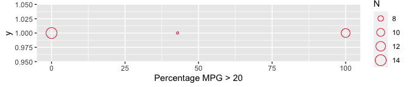
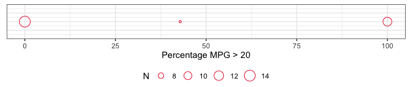
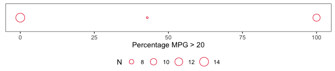

<!-- README.md is generated from README.Rmd. Please edit that file -->

kpitools
========

Tools for creating key performance indicator (KPI) reports.

Example usage
=============

The package can be installed from
[github](https://github.com/CTU-Bern/kpitools) via the `remotes` package

    # install.packages("remotes")
    remotes::install_github("CTU-Bern/kpitools")

Note that `remotes` treats any warnings (e.g. that a certain package was
built under a different version of R) as errors. If you see such an
error, run the following line and try again:

    Sys.setenv(R_REMOTES_NO_ERRORS_FROM_WARNINGS = "true")

And loaded via

    library(kpitools)

Calculating KPIs
----------------

The main function is the `kpi` function. A dataframe is passed to it
together with the `var`iable that is of interest for the current KPI. A
summary function also needs to be passed which determines how the KPI is
calculated.

    data(mtcars)

    mtcars$highmpg <- mtcars$mpg > 20

    mtcars %>%
      kpi(var = "highmpg",             # variable to be summarized (focus of the KPI)
          kpi_fn = kpi_fn_perc,        # summary function
          txt = "Percentage MPG > 25") # (optional) nicer text to add to tables

    ## Study level:
    ##                  txt  n  N  stat
    ##  Percentage MPG > 25 14 32 43.75

It is also possible to calculate the KPIs over specific groups via the
`by` option:

    mtcars %>%
      kpi(var = "highmpg",             # variable to be summarized (focus of the KPI)
          kpi_fn = kpi_fn_perc,        # summary function
          txt = "Percentage MPG > 20", # (optional) nicer text to add to tables
          by = "am")                   # (optional) stratifying variable

    ## Study level:
    ##                  txt  n  N  stat
    ##  Percentage MPG > 20 14 32 43.75
    ## 
    ## Grouped by am:
    ##                  txt am  n  N     stat
    ##  Percentage MPG > 20  0  4 19 21.05263
    ##  Percentage MPG > 20  1 10 13 76.92308
    ## 
    ## No outliers

The `by` argument also works over multiple variables:

    mtcars %>%
      kpi(var = "highmpg",             # variable to be summarized (focus of the KPI)
          kpi_fn = kpi_fn_perc,        # summary function
          txt = "Percentage MPG > 20", # (optional) nicer text to add to tables
          by = c("am", "gear"))        # (optional) stratifying variables

    ## Study level:
    ##                  txt  n  N  stat
    ##  Percentage MPG > 20 14 32 43.75
    ## 
    ## Grouped by am:
    ##                  txt am  n  N     stat
    ##  Percentage MPG > 20  0  4 19 21.05263
    ##  Percentage MPG > 20  1 10 13 76.92308
    ## 
    ## No outliers
    ## Grouped by gear:
    ##                  txt gear  n  N     stat
    ##  Percentage MPG > 20    3  2 15 13.33333
    ##  Percentage MPG > 20    4 10 12 83.33333
    ##  Percentage MPG > 20    5  2  5 40.00000
    ## 
    ## No outliers

KPIs are often reported with cutoffs (for use with a traffic light type
approach). Cutoffs can be passed to `kpi`, with or without labels.

    # without labels
    mtcars %>%
      kpi(var = "highmpg",                # variable to be summarized (focus of the KPI) 
          kpi_fn = kpi_fn_perc,           # summary function 
          txt = "Percentage MPG > 20",    # (optional) nicer text to add to tables
          by = "am",                      # (optional) stratifying variable
          cutpoints = c(0,33.3,66.6,100)) # (optional) cutoff points

Add in cutoffs for quality with labels

    mtcars %>%
      kpi(var = "highmpg",                        # variable to be summarized (focus of the KPI)  
          kpi_fn = kpi_fn_perc,                   # summary function   
          txt = "Percentage MPG > 20",            # (optional) nicer text to add to tables 
          by = "am",                              # (optional) stratifying variable 
          cutpoints = c(0,33.3,66.6,100),         # (optional) cutoff points 
          cutlabels = c("Low", "Medium", "High")) # (optional) labels for the cutoff points

    ## Study level:
    ##                  txt  n  N  stat         cut cutgrp
    ##  Percentage MPG > 20 14 32 43.75 (33.3,66.6] Medium
    ## 
    ## Grouped by am:
    ##                  txt am  n  N     stat        cut cutgrp
    ##  Percentage MPG > 20  0  4 19 21.05263   (0,33.3]    Low
    ##  Percentage MPG > 20  1 10 13 76.92308 (66.6,100]   High
    ## 
    ## No outliers

Visualising variation among levels of the study hierarchy
---------------------------------------------------------

There is a plot method for the output from `kpi` which returns a list of
`ggplot2` objects.

    kpi <- mtcars %>%
      kpi(var = "highmpg", 
          kpi_fn = kpi_fn_perc, 
          txt = "Percentage MPG > 20",
          by = "cyl")

    (plot <- plot(kpi))

    ## $cyl

`ggplot2` objects allow for easy modification after their creation for
further customisation.

    plot$cyl +
      theme_bw() +
      theme(legend.position = "bottom",
            axis.text.y = element_blank(),
            axis.title.y = element_blank(),
            axis.ticks.y = element_blank(),
            legend.margin = margin(0,0,0,0)
            )

A `ggplot2` theme is also provided which implements modifications
similar to those above - `theme_kpitools`.

    plot$cyl +
      theme_kpitools()

