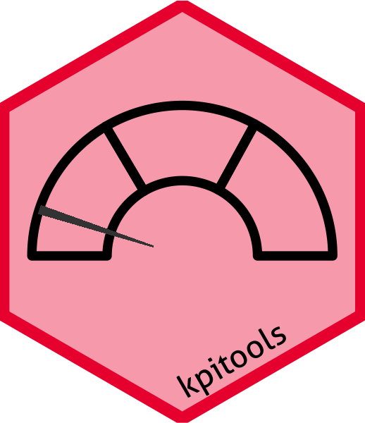

<!-- README.md is generated from README.Rmd. Please edit that file -->

# kpitools 

[](https://github.com/CTU-Bern/kpitools)
[](https://github.com/CTU-Bern/kpitools/actions/workflows/R-CMD-full.yaml)

Tools for creating key performance indicator (KPI) reports.

# Example usage

The package can be installed from the CTU Bern universe via

``` r
install.packages('kpitools', repos = 'https://ctu-bern.r-universe.dev')
```

And loaded via

``` r
library(kpitools)
```

The main function is the `kpi` function. A dataframe is passed to it
together with the `var`iable that is of interest for the current KPI. A
summary function also needs to be passed which determines how the KPI is
calculated.

``` r
data(mtcars)

mtcars$highmpg <- mtcars$mpg > 20
```

``` r
kpis <- (mtcars %>%
  kpi(var = "highmpg",                          # variable to be summarized (focus of the KPI)  
      kpi_fn = kpi_fn_perc,                     # summary function   
      txt = "Percentage MPG > 20",              # (optional) nicer text to add to tables 
      by = "cyl",                               # (optional) stratifying variable 
      breakpoints = c(0,33.3,66.6,100),         # (optional) cutoff points 
      risklabels = c("Low", "Medium", "High"))) # (optional) labels for the cutoff points
```

There is a plot method for the output from `kpi` which returns a list of
`ggplot2` objects.

``` r
plot <- plot(kpis)
plot$cyl +
  theme_kpitools()
```

<!-- -->

For further details, see the vignette:

``` r
vignette("kpitools")
```
